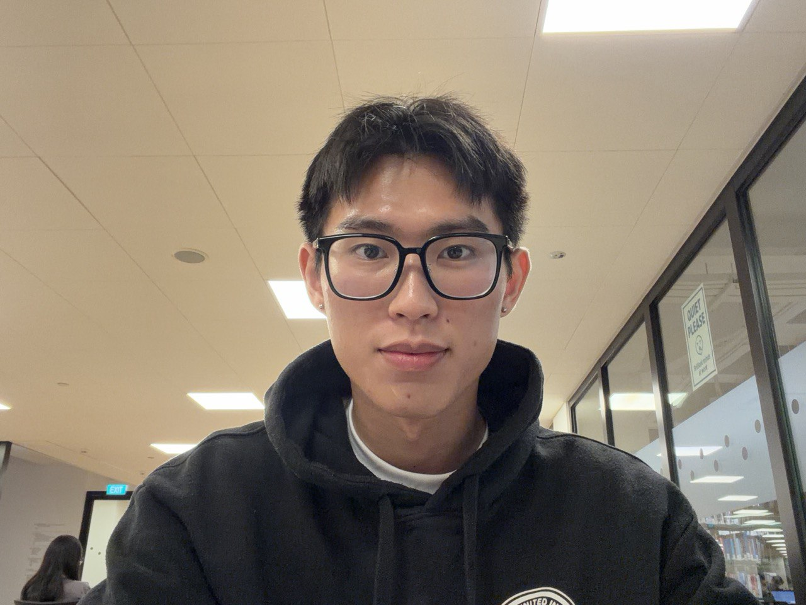
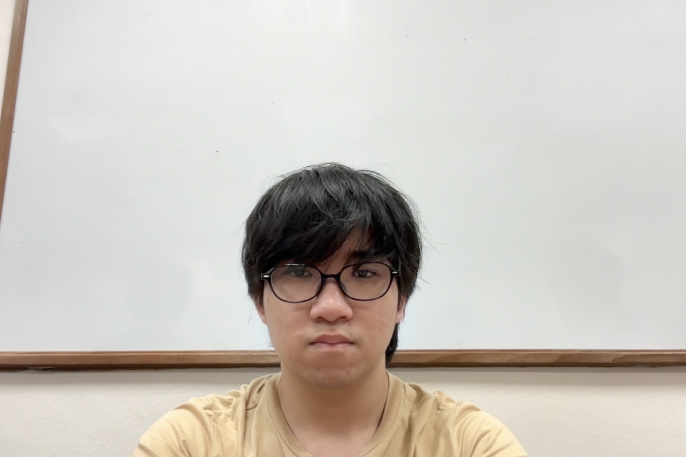

We are a team based in the [School of Computing, National University of Singapore](https://www.comp.nus.edu.sg).

You can reach us at the email `seer[at]comp.nus.edu.sg`

## Project team

### Yong ee

[[GitHub](https://github.com/yongtheskill)]

- Role: Developer

### Ashwin Govind

[[GitHub](https://github.com/ashw1ng)]

- Role: Developer
- Responsibilities: UI

### Tan Hong Xu

[[GitHub](https://github.com/yonktheskill)] [[portfolio](team/tanhongxu.md)]

- Role: Developer
- Responsibilities: Data

### Ng Shu Kai Alden

[[GitHub](https://github.com/aldenngsk)]

- Role: Developer
- Responsibilities: Dev Ops + Threading

### Ng Xiang En Evan

[[GitHub](https://github.com/evananann)]

- Role: Developer
- Responsibilities: UI
