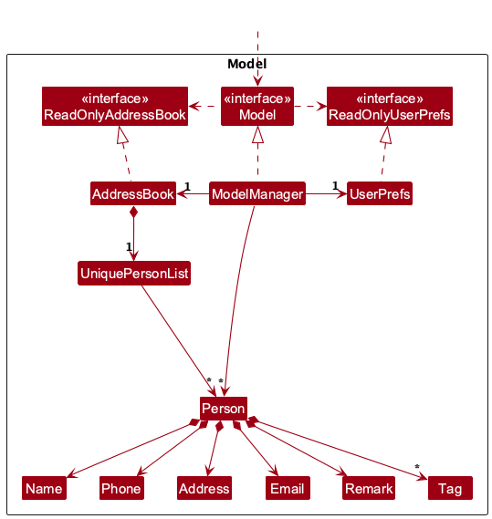

- Table of Contents
  {:toc}

---

## **Acknowledgements**

- {list here sources of all reused/adapted ideas, code, documentation, and third-party libraries -- include links to the original source as well}

---

## **Setting up, getting started**

Refer to the guide [_Setting up and getting started_](SettingUp.md).

---

## **Design**

:bulb: **Tip:** The `.puml` files used to create diagrams are in this document `docs/diagrams` folder. Refer to the [_PlantUML Tutorial_ at se-edu/guides](https://se-education.org/guides/tutorials/plantUml.html) to learn how to create and edit diagrams.

### Architecture

The **_Architecture Diagram_** given above explains the high-level design of the App.

Given below is a quick overview of main components and how they interact with each other.

**Main components of the architecture**

**`Main`** (consisting of classes [`Main`](https://github.com/se-edu/addressbook-level3/tree/master/src/main/java/seedu/address/Main.java) and [`MainApp`](https://github.com/se-edu/addressbook-level3/tree/master/src/main/java/seedu/address/MainApp.java)) is in charge of the app launch and shut down.

- At app launch, it initializes the other components in the correct sequence, and connects them up with each other.
- At shut down, it shuts down the other components and invokes cleanup methods where necessary.

The bulk of the app's work is done by the following four components:

- [**`UI`**](#ui-component): The UI of the App.
- [**`Logic`**](#logic-component): The command executor.
- [**`Model`**](#model-component): Holds the data of the App in memory.
- [**`Storage`**](#storage-component): Reads data from, and writes data to, the hard disk.

[**`Commons`**](#common-classes) represents a collection of classes used by multiple other components.

**How the architecture components interact with each other**

The _Sequence Diagram_ below shows how the components interact with each other for the scenario where the user issues the command `delete 1`.

Each of the four main components (also shown in the diagram above),

- defines its _API_ in an `interface` with the same name as the Component.
- implements its functionality using a concrete `{Component Name}Manager` class (which follows the corresponding API `interface` mentioned in the previous point.

For example, the `Logic` component defines its API in the `Logic.java` interface and implements its functionality using the `LogicManager.java` class which follows the `Logic` interface. Other components interact with a given component through its interface rather than the concrete class (reason: to prevent outside component's being coupled to the implementation of a component), as illustrated in the (partial) class diagram below.

The sections below give more details of each component.

### UI component

The **API** of this component is specified in [`Ui.java`](https://github.com/se-edu/addressbook-level3/tree/master/src/main/java/seedu/address/ui/Ui.java)

The UI consists of a `MainWindow` that is made up of parts e.g.`CommandBox`, `ResultDisplay`, `PersonListPanel`, `StatusBarFooter` etc. All these, including the `MainWindow`, inherit from the abstract `UiPart` class which captures the commonalities between classes that represent parts of the visible GUI.

The `UI` component uses the JavaFx UI framework. The layout of these UI parts are defined in matching `.fxml` files that are in the `src/main/resources/view` folder. For example, the layout of the [`MainWindow`](https://github.com/se-edu/addressbook-level3/tree/master/src/main/java/seedu/address/ui/MainWindow.java) is specified in [`MainWindow.fxml`](https://github.com/se-edu/addressbook-level3/tree/master/src/main/resources/view/MainWindow.fxml)

The `UI` component,

- executes user commands using the `Logic` component.
- listens for changes to `Model` data so that the UI can be updated with the modified data.
- keeps a reference to the `Logic` component, because the `UI` relies on the `Logic` to execute commands.
- depends on some classes in the `Model` component, as it displays `Person` object residing in the `Model`.

### Logic component

**API** : [`Logic.java`](https://github.com/se-edu/addressbook-level3/tree/master/src/main/java/seedu/address/logic/Logic.java)

Here's a (partial) class diagram of the `Logic` component:

The sequence diagram below illustrates the interactions within the `Logic` component, taking `execute("delete 1")` API call as an example.

:information_source: **Note:** The lifeline for `DeleteCommandParser` should end at the destroy marker (X) but due to a limitation of PlantUML, the lifeline continues till the end of diagram.

How the `Logic` component works:

1. When `Logic` is called upon to execute a command, it is passed to an `AddressBookParser` object which in turn creates a parser that matches the command (e.g., `DeleteCommandParser`) and uses it to parse the command.
1. This results in a `Command` object (more precisely, an object of one of its subclasses e.g., `DeleteCommand`) which is executed by the `LogicManager`.
1. The command can communicate with the `Model` when it is executed (e.g. to delete a person). 
   Note that although this is shown as a single step in the diagram above (for simplicity), in the code it can take several interactions (between the command object and the `Model`) to achieve.
1. The result of the command execution is encapsulated as a `CommandResult` object which is returned back from `Logic`.

Here are the other classes in `Logic` (omitted from the class diagram above) that are used for parsing a user command:

How the parsing works:

- When called upon to parse a user command, the `AddressBookParser` class creates an `XYZCommandParser` (`XYZ` is a placeholder for the specific command name e.g., `AddCommandParser`) which uses the other classes shown above to parse the user command and create a `XYZCommand` object (e.g., `AddCommand`) which the `AddressBookParser` returns back as a `Command` object.
- All `XYZCommandParser` classes (e.g., `AddCommandParser`, `DeleteCommandParser`, ...) inherit from the `Parser` interface so that they can be treated similarly where possible e.g, during testing.

### Model component

**API** : [`Model.java`](https://github.com/se-edu/addressbook-level3/tree/master/src/main/java/seedu/address/model/Model.java)

The `Model` component,

- stores the address book data i.e., all `Person` objects (which are contained in a `UniquePersonList` object).
- stores the currently 'selected' `Person` objects (e.g., results of a search query) as a separate _filtered_ list which is exposed to outsiders as an unmodifiable `ObservableList<Person>` that can be 'observed' e.g. the UI can be bound to this list so that the UI automatically updates when the data in the list change.
- stores a `UserPref` object that represents the user’s preferences. This is exposed to the outside as a `ReadOnlyUserPref` objects.
- does not depend on any of the other three components (as the `Model` represents data entities of the domain, they should make sense on their own without depending on other components)

:information_source: **Note:** An alternative (arguably, a more OOP) model is given below. It has a `Tag` list in the `AddressBook`, which `Person` references. This allows `AddressBook` to only require one `Tag` object per unique tag, instead of each `Person` needing their own `Tag` objects. 

### Storage component

**API** : [`Storage.java`](https://github.com/se-edu/addressbook-level3/tree/master/src/main/java/seedu/address/storage/Storage.java)

The `Storage` component,

- can save both address book data and user preference data in JSON format, and read them back into corresponding objects.
- inherits from both `AddressBookStorage` and `UserPrefStorage`, which means it can be treated as either one (if only the functionality of only one is needed).
- depends on some classes in the `Model` component (because the `Storage` component's job is to save/retrieve objects that belong to the `Model`)

### Common classes

Classes used by multiple components are in the `seedu.address.commons` package.

---

## **Implementation**

This section describes some noteworthy details on how certain features are implemented.

### Starred contacts feature

The starred contacts feature adds a `starred` boolean state to `Person`, with the following behavior:

1. `star INDEX` marks the person at the displayed index as starred.
2. `unstar INDEX` removes the starred state from the person at the displayed index.
3. Repeating `star` on an already-starred person (or `unstar` on an already-unstarred person) is handled as an informative no-op.

#### Model and ordering

- `Person` stores `starred` as a data field (default `false`).
- `Person#isSamePerson` is unchanged (identity remains name-based).
- Full object equality/hash semantics include `starred`.
- `AddressBook` enforces starred-first ordering after person-list mutations.
- Within the starred and unstarred groups, relative order is preserved.

#### Storage

- `JsonAdaptedPerson` persists the `starred` field.
- Backward compatibility is preserved by treating missing `starred` values in legacy JSON files as `false`.

#### UI

- `PersonCard` renders a subtle star marker for starred contacts.
- The marker is hidden for unstarred contacts to keep the layout compact.

### \[Proposed\] Undo/redo feature

#### Proposed Implementation

The proposed undo/redo mechanism is facilitated by `VersionedAddressBook`. It extends `AddressBook` with an undo/redo history, stored internally as an `addressBookStateList` and `currentStatePointer`. Additionally, it implements the following operations:

- `VersionedAddressBook#commit()` — Saves the current address book state in its history.
- `VersionedAddressBook#undo()` — Restores the previous address book state from its history.
- `VersionedAddressBook#redo()` — Restores a previously undone address book state from its history.

These operations are exposed in the `Model` interface as `Model#commitAddressBook()`, `Model#undoAddressBook()` and `Model#redoAddressBook()` respectively.

Given below is an example usage scenario and how the undo/redo mechanism behaves at each step.

Step 1. The user launches the application for the first time. The `VersionedAddressBook` will be initialized with the initial address book state, and the `currentStatePointer` pointing to that single address book state.

Step 2. The user executes `delete 5` command to delete the 5th person in the address book. The `delete` command calls `Model#commitAddressBook()`, causing the modified state of the address book after the `delete 5` command executes to be saved in the `addressBookStateList`, and the `currentStatePointer` is shifted to the newly inserted address book state.

Step 3. The user executes `add n/David …​` to add a new person. The `add` command also calls `Model#commitAddressBook()`, causing another modified address book state to be saved into the `addressBookStateList`.

:information_source: **Note:** If a command fails its execution, it will not call `Model#commitAddressBook()`, so the address book state will not be saved into the `addressBookStateList`.

Step 4. The user now decides that adding the person was a mistake, and decides to undo that action by executing the `undo` command. The `undo` command will call `Model#undoAddressBook()`, which will shift the `currentStatePointer` once to the left, pointing it to the previous address book state, and restores the address book to that state.

:information_source: **Note:** If the `currentStatePointer` is at index 0, pointing to the initial AddressBook state, then there are no previous AddressBook states to restore. The `undo` command uses `Model#canUndoAddressBook()` to check if this is the case. If so, it will return an error to the user rather
than attempting to perform the undo.

The following sequence diagram shows how an undo operation goes through the `Logic` component:

:information_source: **Note:** The lifeline for `UndoCommand` should end at the destroy marker (X) but due to a limitation of PlantUML, the lifeline reaches the end of diagram.

Similarly, how an undo operation goes through the `Model` component is shown below:

The `redo` command does the opposite — it calls `Model#redoAddressBook()`, which shifts the `currentStatePointer` once to the right, pointing to the previously undone state, and restores the address book to that state.

:information_source: **Note:** If the `currentStatePointer` is at index `addressBookStateList.size() - 1`, pointing to the latest address book state, then there are no undone AddressBook states to restore. The `redo` command uses `Model#canRedoAddressBook()` to check if this is the case. If so, it will return an error to the user rather than attempting to perform the redo.

Step 5. The user then decides to execute the command `list`. Commands that do not modify the address book, such as `list`, will usually not call `Model#commitAddressBook()`, `Model#undoAddressBook()` or `Model#redoAddressBook()`. Thus, the `addressBookStateList` remains unchanged.

Step 6. The user executes `clear`, which calls `Model#commitAddressBook()`. Since the `currentStatePointer` is not pointing at the end of the `addressBookStateList`, all address book states after the `currentStatePointer` will be purged. Reason: It no longer makes sense to redo the `add n/David …​` command. This is the behavior that most modern desktop applications follow.

The following activity diagram summarizes what happens when a user executes a new command:

#### Design considerations:

**Aspect: How undo & redo executes:**

- **Alternative 1 (current choice):** Saves the entire address book.
    - Pros: Easy to implement.
    - Cons: May have performance issues in terms of memory usage.

- **Alternative 2:** Individual command knows how to undo/redo by
  itself.
    - Pros: Will use less memory (e.g. for `delete`, just save the person being deleted).
    - Cons: We must ensure that the implementation of each individual command are correct.

_{more aspects and alternatives to be added}_

### Data archiving

#### Implementation

The data archiving feature is implemented with an `isArchived` flag in `Person`.

- `archive INDEX` marks a contact as archived.
- `unarchive INDEX` restores an archived contact to active status.
- `list` shows only active contacts.
- `listarchived` shows only archived contacts.

The archive status is persisted in JSON storage through `JsonAdaptedPerson` using an `archived` property.
To preserve backward compatibility with existing save files, missing `archived` values are treated as `false`.

#### Command flow

1. `AddressBookParser` routes `archive` and `unarchive` to their dedicated parsers.
2. The parsers parse a one-based index using `ParserUtil.parseIndex`.
3. The command resolves the target `Person` from `Model#getFilteredPersonList`.
4. The command creates a new `Person` copy with the same fields except updated `isArchived`.
5. `Model#setPerson` replaces the target person and refreshes the filtered list.

#### Filtering behavior

The app defaults to showing active contacts only.

- `Model.PREDICATE_SHOW_ACTIVE_PERSONS` is used by default list views.
- `find` and `filter` apply their predicates together with the active predicate.
- `listarchived` uses `Person::isArchived` to show archived entries explicitly.

#### Design considerations

- Alternative considered: physically moving archived contacts into a separate list.
    - Rejected because it would complicate storage and command behavior.
- Current approach: keep a single person list with an archive flag.
    - Simpler migration path and minimal changes to existing command architecture.

#### Tests

Coverage includes:

- `ArchiveCommandTest` and `UnarchiveCommandTest` for command behavior.
- `ArchiveCommandParserTest` and `UnarchiveCommandParserTest` for parser validation.
- `AddressBookParserTest` routing coverage for `archive`, `unarchive`, and `listarchived`.
- `JsonAdaptedPersonTest` for archive persistence and backward compatibility defaults.
- `ModelManagerTest` and `PersonTest` regression checks for archive filtering and object semantics.

---

## **Documentation, logging, testing, configuration, dev-ops**

- [Documentation guide](Documentation.md)
- [Testing guide](Testing.md)
- [Logging guide](Logging.md)
- [Configuration guide](Configuration.md)
- [DevOps guide](DevOps.md)

---

## **Appendix: Requirements**

### Product scope

**Target user profile**:

- An NUS CS student (or similar tech-savvy student) involved in multiple project teams, hackathons, and internships simultaneously
- Maintains a large and growing list of contacts such as teammates, tutors, professors, and friends
- Works primarily on a personal laptop
- Prefers CLI-based tools and keyboard-driven workflows
- Values speed, organisation, and minimal distraction
- Often overwhelmed by an unstructured contact list and struggles to retrieve specific contact details quickly

**Value proposition**: TaskNest helps users who manage many contacts across multiple commitments to store and organise contact information efficiently, search and retrieve contacts quickly via a fast CLI interface, and reduce clutter as their contact list grows — all faster than a typical mouse/GUI-driven app.

### User stories

Priorities: High (must have) - `* * *`, Medium (should have) - `* *`, Low (nice to have) - `*`

| Priority | As a …​                        | I want to …​                                                          | So that I can…​                                                              |
| -------- | ------------------------------ | --------------------------------------------------------------------- | ---------------------------------------------------------------------------- |
| `* * *`  | new user                       | see usage instructions                                                | refer to instructions when I forget how to use the app                       |
| `* * *`  | user                           | add a new contact with a name, phone number, and email                | store details of people I meet                                               |
| `* * *`  | user                           | delete a contact                                                      | remove obsolete or incorrectly entered entries                               |
| `* * *`  | user                           | edit a contact's details                                              | keep information up to date when it changes                                  |
| `* * *`  | user                           | list all my contacts                                                  | see everyone I have stored at a glance                                       |
| `* * *`  | user                           | search for a contact by name                                          | retrieve someone's details quickly without scrolling through the entire list |
| `* * *`  | user                           | receive validation feedback for an invalid email format               | ensure my data is accurate and consistent                                    |
| `* * *`  | user                           | receive validation feedback for an invalid phone number               | ensure my data is accurate and consistent                                    |
| `* * *`  | user                           | be asked to confirm before a contact is deleted                       | avoid accidentally losing important contact information                      |
| `* *`    | user with a large contact list | filter contacts by tag                                                | quickly find people associated with a particular group or project            |
| `* *`    | user                           | have my contacts sorted alphabetically by default                     | browse the list in a predictable, organised order                            |
| `* *`    | user                           | be warned when I try to add a duplicate contact                       | avoid cluttering my list with repeated entries                               |
| `* *`    | user                           | search contacts across all fields (name, phone, email, address, tags) | find someone even if I only remember a partial detail                        |
| `*`      | user                           | undo a delete action                                                  | recover from accidental deletions                                            |
| `*`      | user                           | archive contacts I no longer actively use                             | keep the main list clean without permanently losing information              |
| `*`      | user                           | export my contact list                                                | back up my data or share it with others                                      |
| `*`      | user                           | store multiple phone numbers or emails for one contact                | accommodate contacts who have more than one reachable number or address      |
| `*`      | power user                     | use keyboard shortcuts for common actions                             | work even faster without breaking my typing rhythm                           |

### Use cases

(For all use cases below, the **System** is `TaskNest` and the **Actor** is the `user`, unless specified otherwise)

---

**Use case: UC01 — Add a new contact**

**MSS**

1. User enters the `add` command with the required fields (name, phone, email) and any optional fields (address, tags).
2. TaskNest validates all provided fields.
3. TaskNest checks that no duplicate contact (same name and phone) exists.
4. TaskNest adds the contact and displays a success message with the new contact's details.

    Use case ends.

**Extensions**

- 2a. One or more fields fail validation.
    - 2a1. TaskNest shows the relevant error message for the first invalid field.

        Use case resumes at step 1.

- 3a. A duplicate contact is detected.
    - 3a1. TaskNest shows a duplicate contact error message.

        Use case resumes at step 1.

---

**Use case: UC02 — Find and edit a contact**

**MSS**

1. User enters the `find` command with a keyword.
2. TaskNest displays all contacts whose name (or other fields) match the keyword.
3. User identifies the index of the contact to edit from the filtered list.
4. User enters the `edit` command with the contact's index and the fields to update.
5. TaskNest validates the new field values.
6. TaskNest updates the contact and displays a success message showing the updated details.

    Use case ends.

**Extensions**

- 2a. No contacts match the keyword.
    - 2a1. TaskNest shows a message indicating no results were found.

        Use case ends.

- 4a. The provided index is out of range.
    - 4a1. TaskNest shows an invalid index error message.

        Use case resumes at step 3.

- 4b. No fields are provided to the `edit` command.
    - 4b1. TaskNest shows an error asking the user to specify at least one field.

        Use case resumes at step 4.

- 5a. A field value fails validation.
    - 5a1. TaskNest shows the relevant error message.

        Use case resumes at step 4.

- 5b. The edited contact would duplicate an existing contact.
    - 5b1. TaskNest shows a duplicate contact error and rejects the edit.

        Use case resumes at step 4.

---

**Use case: UC03 — Find and delete a contact**

**MSS**

1. User enters the `find` command with a keyword.
2. TaskNest displays all contacts matching the keyword.
3. User identifies the index of the contact to delete from the filtered list.
4. User enters the `delete` command with the contact's index.
5. TaskNest prompts the user to confirm the deletion.
6. User confirms.
7. TaskNest removes the contact and displays a success message.

    Use case ends.

**Extensions**

- 2a. No contacts match the keyword.
    - 2a1. TaskNest shows a message indicating no results were found.

        Use case ends.

- 3a. The provided index is out of range.
    - 3a1. TaskNest shows an invalid index error message.

        Use case resumes at step 3.

- 6a. User cancels the confirmation.
    - 6a1. TaskNest cancels the deletion and shows a cancellation message.

        Use case ends.

---

**Use case: UC04 — List active contacts**

**MSS**

1. User enters the `list` command.
2. TaskNest displays only active (non-archived) contacts and a count of the total number shown.

    Use case ends.

**Extensions**

- 2a. There are no active contacts.
    - 2a1. TaskNest shows an empty list.

        Use case ends.

---

**Use case: UC05 — Archive and unarchive contacts**

**MSS**

1. User enters the `list` command.
2. TaskNest displays active contacts.
3. User enters `archive INDEX` for a contact in the list.
4. TaskNest marks the contact as archived and removes it from active views.
5. User enters the `listarchived` command.
6. TaskNest displays archived contacts.
7. User enters `unarchive INDEX` for a contact in the archived list.
8. TaskNest marks the contact as active again.
9. User enters `list` and sees the contact in active contacts.

    Use case ends.

**Extensions**

- 3a. `INDEX` is invalid.
    - 3a1. TaskNest shows an invalid index error.

        Use case resumes at step 2.

- 3b. Contact is already archived.
    - 3b1. TaskNest shows an already archived error.

        Use case resumes at step 2.

- 7a. `INDEX` is invalid.
    - 7a1. TaskNest shows an invalid index error.

        Use case resumes at step 6.

- 7b. Contact is already active.
    - 7b1. TaskNest shows an already active error.

        Use case ends.

### Non-Functional Requirements

1. **Portability**: Should work on any _mainstream OS_ (Windows, Linux, macOS) with Java `17` or above installed, without requiring any additional installation steps beyond downloading the JAR file.
2. **Performance**: Should be able to hold up to 1000 contacts without noticeable sluggishness for typical usage. All commands should produce a response within 2 seconds on a modern consumer laptop.
3. **Usability**: A user with above-average typing speed for regular English text should be able to accomplish most tasks faster using CLI commands than using a mouse-driven GUI.
4. **Reliability**: Contact data should be persisted to disk automatically after every command so that no data is lost upon a normal application exit.
5. **Data integrity**: The application should reject all invalid or malformed inputs (e.g., incorrectly formatted phone numbers or emails) and display a clear, specific error message without modifying any stored data.
6. **Learnability**: A new user who has basic familiarity with CLI tools should be able to complete core tasks (add, find, edit, delete) within 10 minutes of first launch, using only the built-in help command.
7. **Scalability**: The contact storage format should remain backwards-compatible across minor version updates so that users do not lose data when upgrading the app.
8. **Single-user**: The product is designed for use by a single user on one machine and does not need to support concurrent access or multi-user synchronisation.

### Glossary

- **CLI (Command-Line Interface)**: A text-based interface where the user types commands to interact with the application, as opposed to using a mouse and graphical elements.
- **Contact**: A person whose details (e.g., name, phone number, email address) are stored in TaskNest.
- **Duplicate contact**: Two contacts that share the same name (case-insensitive) and phone number, considered to represent the same person.
- **Index**: The position number displayed next to a contact in the currently visible list. Used to identify which contact a command should act on.
- **Mainstream OS**: Windows, Linux, Unix, macOS.
- **MSS (Main Success Scenario)**: The sequence of steps in a use case that describes the most straightforward path to a successful outcome.
- **MVP (Minimum Viable Product)**: The smallest set of features required to deliver core value to users. For TaskNest, this includes adding, deleting, editing, listing, and searching contacts with basic validation.
- **Tag**: A short alphanumeric label that can be attached to a contact to group or categorise them (e.g., `friend`, `work`, `project-alpha`).
- **TaskNest**: The name of this contact management application, built for tech-savvy students who manage many contacts across multiple commitments.

---

## **Appendix: Instructions for manual testing**

Given below are instructions to test the app manually.

:information_source: **Note:** These instructions only provide a starting point for testers to work on;
testers are expected to do more *exploratory* testing.

### Launch and shutdown

1. Initial launch
    1. Download the jar file and copy into an empty folder

    1. Double-click the jar file Expected: Shows the GUI with a set of sample contacts. The window size may not be optimum.

1. Saving window preferences
    1. Resize the window to an optimum size. Move the window to a different location. Close the window.

    1. Re-launch the app by double-clicking the jar file. 
       Expected: The most recent window size and location is retained.

1. _{ more test cases …​ }_

### Deleting a person

1. Deleting a person while all persons are being shown
     1. Prerequisites: List active persons using the `list` command. Multiple active persons in the list.

### Archiving and unarchiving a person

1. Archiving a person from active contacts
     1. Prerequisites: Use `list` to show active contacts with at least one person.
     2. Test case: `archive 1` 
         Expected: First listed person is archived. Success message shown. Person no longer appears in `list`.
     3. Test case: `archive 0` 
         Expected: No person is archived. Error details shown.

2. Viewing archived persons
     1. Prerequisites: At least one archived contact exists.
     2. Test case: `listarchived` 
         Expected: Only archived contacts are shown.

3. Unarchiving a person
     1. Prerequisites: Use `listarchived` to show archived contacts with at least one person.
     2. Test case: `unarchive 1` 
         Expected: First archived contact is restored to active status. Success message shown.
     3. Test case: `unarchive 0` 
         Expected: No person is unarchived. Error details shown.

    1. Test case: `delete 1` 
       Expected: First contact is deleted from the list. Details of the deleted contact shown in the status message. Timestamp in the status bar is updated.

    1. Test case: `delete 0` 
       Expected: No person is deleted. Error details shown in the status message. Status bar remains the same.

    1. Other incorrect delete commands to try: `delete`, `delete x`, `...` (where x is larger than the list size) 
       Expected: Similar to previous.

1. _{ more test cases …​ }_

### Saving data

1. Dealing with missing/corrupted data files
    1. _{explain how to simulate a missing/corrupted file, and the expected behavior}_

1. _{ more test cases …​ }_
